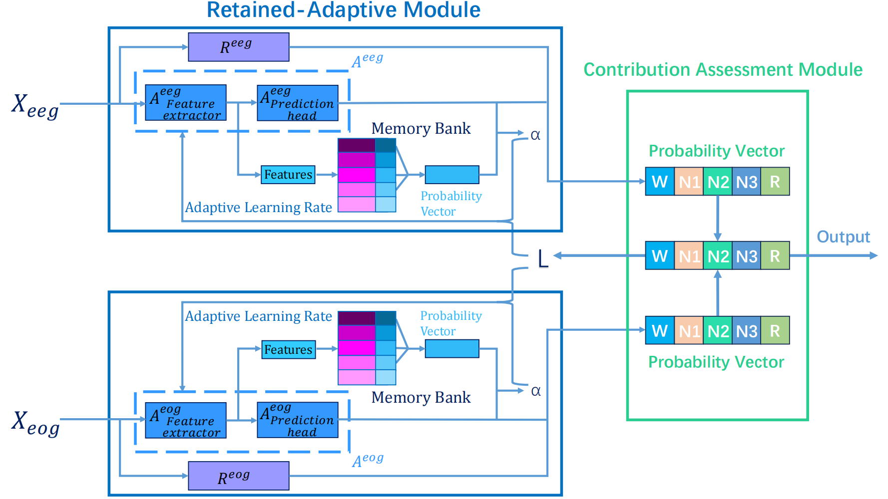

# ATTA: Adaptive Test-Time Adaptation for Multi-Modal Sleep Stage Classification

Code for the method in the paper ATTA: Adaptive Test-Time Adaptation for Multi-Modal Sleep Stage Classification (Accepted by IJCAI 2024).

 

## Datasets

We evaluate the performance of ATTA on [SleepEDF](https://www.physionet.org/content/sleep-edfx/1.0.0/sleep-cassette/#files-panel) and [SHHS](https://sleepdata.org/datasets/shhs) datasets, which are open-access databases of polysomnography (PSG) recordings.

 

## Requirements

You can find information about the requirements in requirements.txt.

 

## Function of file

* `prepare_npz`
  * Prepare npz files from raw data.
* `preprocess_sleepedf.py`
  * Provide functions to preprocess sleep signal sequence for the SleepEDF dataset(E.g., regularization, divide groups).
* `preprocess_shhs.py`
  * Provide functions to preprocess sleep signal sequence for the SHHS dataset(E.g., regularization, divide groups).
* `pretrain_sleepedf_eeg.py` and `pretrain_sleepedf_eog.py`
  * Pre-train a model on the SleepEDF dataset using EEG and EOG signals as input separately.

- `pretrain_shhs_eeg.py` and `pretrain_shhs_eog.py`
  - Pre-train a model on the SHHS dataset using EEG and EOG signals as input separately.

* `memory.py` 
  
  * Define the memory class and implement the operation functions related to the memory bank.
  
* `model_modified.py`
  * ATTA employs a simplified version of [SalientSleepNet]([[2105.13864\] SalientSleepNet: Multimodal Salient Wave Detection Network for Sleep Staging (arxiv.org)](https://arxiv.org/abs/2105.13864)) as the backbone network for pre-training,
  
    where both the MSE and MMA modules are removed.
  
* `test.py` 
  
  * Test the model (from SleepEDF to SHHS, you need to rewrite the data processing part of the code in test.py for different datasets), evaluate testing results and plot result images.
  
  
  
  

## Examples of use

### 1.Get data

Download datasets [SleepEDF](https://www.physionet.org/content/sleep-edfx/1.0.0/sleep-cassette/#files-panel) and [SHHS](https://sleepdata.org/datasets/shhs). The SHHS dataset comprises sleep data from 329 individuals selected from the SHHS1 cohort of the Sleep Heart Health Study, whose Apnea Hypopnea Indexes (AHI) is lower than 5. You can view the filenames of these 329 individuals we selected in the shhs1_329.txt file.

### 2.Data preparation

>$ python prepare_npz/prepare_npz_data_sleepedf.py -d ./data/sleep-cassette -o ./data/sleepedf/npzs

* `--data_dir -d` File path to the edf file that contain sleeping info.
* `--output_dir -o` Directory where to save outputs.
* `--select_ch -s` Choose the channels for training.

>$ python prepare_npz/prepare_npz_data_shhs.py -e ./data/shhs/polysomnography/edfs/shhs1

* `--edf_dir -e` File path to the edf file that contain sleeping info.
* `--xml_dir -x` File path to the xml file.
* `--select_ch -s` Choose the channels for training.

### 3.Pre-training

>$ python SalientSleepNet/pretrain_sleepedf_eeg.py -p pretrained_model/model_sleepedf_eeg.pth
>
>$ python SalientSleepNet/pretrain_sleepedf_eog.py -p pretrained_model/model_sleepedf_eog.pth

* `--batch_size -b` The batch size for optimization.
* `--train_epoch -t` The number of  epoch to train the model.
* `--folds -f` The total fold number of k-fold validation (E.g., 20 means use 20-fold validation).
* `--window_size -w` The window size of the model.
* `--pth_dir -p` Directory where to save the parameter of the pre-trained model.

### 4.Testing

>$ python ./test.py -d "./data/sleepedf/npzs" -m 1e-2

* `--data_path -d` The address of data (directory of npz files).

* `--pth_dir -p` The address of pre-trained model (directory of pth files).

* `--batch_size -b` The batch size for optimization.

* `--window_size -w` The window size of the model.

* `--lr -l` Learning rate.

* `--optimizer_method -o` Optimizer method.

* `--momentum -m` The momentum for the update of retained model.

* `--memory_size` The size of the memory bank.

* `--retrieval_size -r` The number of feature vectors retrieved from the memory bank 

* `--title_name -t` Image name of the confusion matrix

  
